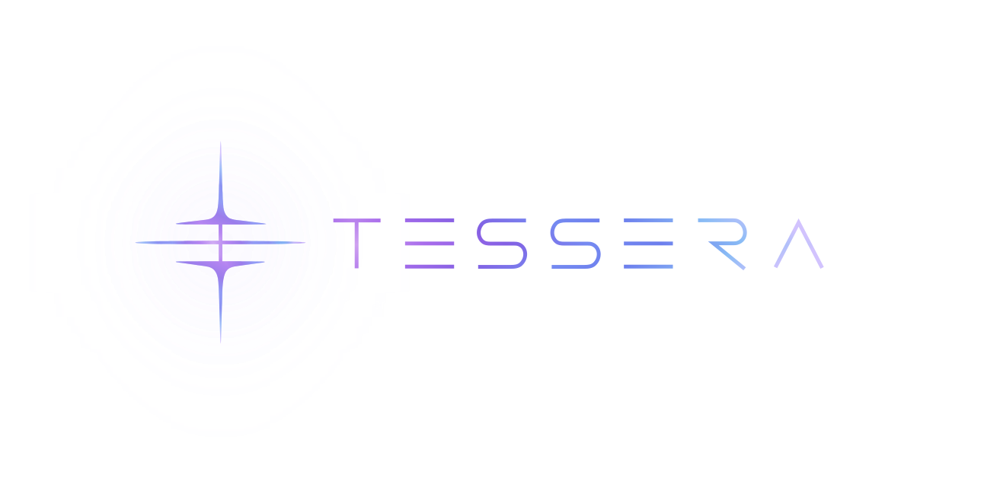

<p align="center">
  
</p>

# TESSERA

**A text-first memory and evidence layer for AI agents, with stable identity, explainable retrieval, and source-level provenance.**

TESSERA turns project knowledge into structured evidence an agent can query without making the agent own the memory system underneath.

- **Text-first** — Markdown and textual sources remain authoritative.
- **Auditable** — results trace back to source documents, versions, and evidence spans when provable.
- **Explainable** — retrieval signals and relevant evidence are inspectable instead of hidden behind one opaque score.
- **Agent-agnostic** — use the Python API, CLI, or MCP surface without coupling memory to one agent runtime.

[Install](#install) · [Quickstart](#quickstart) · [Python API](#python-api) · [Features](#features) · [Benchmarks](#benchmarks) · [How it works](#how-it-works) · [Research](#research-references) · [Documentation](#documentation) · [Contributors](#contributors)

[](https://github.com/LuigiFerronatto/TESSERA/actions/workflows/tessera-ci.yml)

## Install

TESSERA requires Python 3.9+.

Install the current repository version with `pip`:

```bash
python -m pip install "git+https://github.com/LuigiFerronatto/TESSERA.git"
```

For development:

```bash
git clone https://github.com/LuigiFerronatto/TESSERA.git
cd TESSERA
python -m pip install -e ".[dev]"
```

For a locally built release artifact, use a clean wheel rather than an editable
checkout:

```bash
python -m build
python -m pip install ./dist/tessera-3.4.0-py3-none-any.whl
python -m pip install "./dist/tessera-3.4.0-py3-none-any.whl[mcp]"  # optional MCP transport
python -m pip install "./dist/tessera-3.4.0-py3-none-any.whl[llm]"  # optional HTTP LLM bridge
python -m pip install --upgrade ./dist/tessera-3.4.0-py3-none-any.whl
python -m pip uninstall tessera
```

The project version is currently `3.4.0`; `pyproject.toml`, `tessera.__version__`
and installed distribution metadata must agree. Version changes are release
decisions, not automatic consequences of individual Test Cards.

TESSERA is not documented here as a PyPI package or release binary until those distribution channels are actually published.

## Quickstart

Configure this project, write one fact, index it, and query it. The config is
human-readable and contains no credential:

```bash
tessera init --project . --store memories --non-interactive

tessera write \
  --id project/database \
  --type factual \
  --episode setup \
  --content "The project uses PostgreSQL as its primary database." \
  --tags database,postgresql

tessera index

tessera query "what database does the project use?"
```

From a nested directory TESSERA checks only the exact
`.tessera/config.yaml` marker on each physical ancestor; the nearest config
wins. Inspect the decision with `tessera config show` or
`tessera config show --json`.

A user-global registry remembers named stores without copying or merging their
memory:

```bash
tessera init --global research --store /absolute/path/to/research --non-interactive
tessera config show --global research --json
tessera config list
tessera config doctor
tessera config unregister research  # metadata only; never deletes the store
```

Selection precedence is explicit `--store`/positional path,
`TESSERA_STORAGE_DIR`, deprecated warning-emitting `LAO_MEM_DIR`, nearest
project config, then an explicitly named global entry. Otherwise product CLI
operations fail with an actionable configuration error. The direct Python
compatibility resolver and no-configuration MCP fallback retain historical
`./memories` fallback; existing callers do not migrate automatically. See
[ADR 0003](docs/adr/0003-configuration-and-store-discovery.md).

Source files remain the source of truth. New project configuration is schema v2:
`store.path` is the generated-memory destination, `sources.roots` is an
explicit read/index allow list, and `index.path` is disposable derived state.
`tessera init` deliberately starts conservatively with only the store as a
source and `.tessera/index` as the project index; it does not scan the
repository. Existing schema-v1 and direct `storage_dir` callers retain their
previous store-only corpus.

To opt into known project sources explicitly, edit the generated config:

```yaml
schema_version: 2
store:
  id: <UUID generated by tessera init>
  path: memories
sources:
  roots:
    - path: .
      include:
        - README.md
        - docs/**/*.md
        - research/**/*.md
        - memories/**/*.md
index:
  path: .tessera/index
```

Source roots are read/index only and must stay within the physical project;
generated writes remain inside `store.path`. Automatic discovery,
`.tessera-ignore`, and source-picker UX remain future #154/#155 work.

Markdown is the only canonical writable persistence format. Every successful
Engine, CLI, or MCP write creates a `.md` source that the current indexer can
discover. Unsupported formats are rejected before sanitization or any storage,
registry, graph, index, or Evidence Ledger mutation; arbitrary JSON ingestion is
not supported.

Every write is decided before persistence using the deterministic contract
`path validation → detection → optional transformation → admission →
persistence`. Logical memory IDs use portable forward-slash segments and must
resolve strictly inside the configured store. Safe content is accepted
unchanged and is never labeled sanitized. Direct known hostile instructions are
rejected; empty input is rejected; quoted/documentary examples and
suspicious-tag-only inputs go to `review`. Those non-accepting outcomes have no
canonical persistence side effects. See
[`docs/WRITE_GATE_CONTRACT.md`](docs/WRITE_GATE_CONTRACT.md).

### Query existing project knowledge

TESSERA can also index explicitly configured Markdown with complete, partial,
or absent frontmatter. It recognizes textual artifacts such as:

```text
memories/*.md
research/*.md
AGENTS.md
CLAUDE.md
*.SKILL.md
```

It does not treat source code as the primary memory corpus.

## Python API

```python
from tessera import TesseraEngine

engine = TesseraEngine(storage_dir="./memories")
engine.build_index()

results = engine.retrieve_context(
    "what database does the project use?",
    top_n=3,
)

for result in results:
    print(result["id"], result["score"])
    print(result["relevant_evidence"])
    print(result["provenance"])
```

A structured retrieval result can include:

```text
id
score + score_explain
relevant_evidence
full memory body
source path
stable source-document identity
source version hashes
evidence span
related memory IDs
```

See [`docs/OUTPUT_CONTRACT.md`](docs/OUTPUT_CONTRACT.md) for field semantics and nullability.

## Why TESSERA

Saving information is easy. Maintaining useful memory over time is harder.

An agent eventually needs to answer questions such as:

- Is this still the same memory after a file moves?
- Which source version supports this result?
- Why did this memory rank above another one?
- Which part of the source is relevant to this query?
- Are two memories related, outdated, or conflicting?

TESSERA makes those concerns part of the memory layer instead of pushing them into prompts, ad-hoc file conventions, or opaque retrieval infrastructure.

## Features

| Capability | Current behavior |
| --- | --- |
| Text ingestion | Canonicalizes Markdown with complete, partial, or absent frontmatter |
| Memory model | Preserves exactly three semantic drawers: `facts`, `preferences`, `insights` |
| Stable identity | Separates persistent memory/source identity from file path and content version |
| Explainable retrieval | Combines inspectable lexical, metadata, title, relation, and type signals |
| Query-aware evidence | Surfaces relevant evidence while preserving the full original memory |
| Provenance | Tracks source document, source version hashes, and exact spans when provable |
| Explicit relations | Preserves relationships and direct navigation between memories |
| Interfaces | Python API, CLI, and MCP |
| Evaluation | Python 3.9/3.12 tests, CLI smoke, and deterministic sanity retrieval evaluation |

### Deliberate boundaries

TESSERA is memory infrastructure, not the final reasoning agent. It does not:

- generate the final answer on behalf of the consuming agent;
- treat retrieval relevance as truth, confidence, or authority;
- silently rewrite source documents while indexing;
- require a generative LLM for the basic retrieval path;
- claim experimental temporal, arbitration, abstention, or adaptive-retrieval work as finished;
- use source-code indexing as its primary memory model.

The binding boundary is recorded in
[`ADR 0001`](docs/adr/0001-core-vs-optional-llm-boundary.md): deterministic
TESSERA retrieval ends at structured evidence with provenance; cognition and
the final response belong to the consuming agent. The repository also contains
a legacy, explicitly assisted orchestration path for LLM planning and context
synthesis. It is optional behavior, is not part of the deterministic retrieval
contract, and project-specific adapters require explicit deprecated
compatibility selection plus an endpoint or exact router path. No provider is
auto-probed. Target O0–O4 adapter semantics in the ADR are architecture
constraints, not claims that those future modes are implemented.

Base installation does not install an LLM provider SDK. `tessera[mcp]` adds the
MCP transport and `tessera[llm]` adds the current HTTP bridge dependency; these
extras do not change ownership of reasoning or final-answer policy.

Storage resolution is deterministic: an explicit command/API path wins, then
`TESSERA_STORAGE_DIR`, then the deprecated `LAO_MEM_DIR` compatibility alias,
then `./memories`. The canonical variable always outranks the alias, alias use
warns on the human-facing channel, and no project-specific directory is
auto-discovered. An explicitly supplied path remains valid regardless of name.

Existing project-specific assisted users can migrate through the deprecated
explicit boundary while moving to an application-owned `llm_fn`:

```python
from tessera.llm_bridge import resolve_llm_fn

llm_fn = resolve_llm_fn(
    backend="legacy-blip-gateway",
    endpoint=configured_endpoint,
    api_key=configured_key,
    contact_id=configured_contact,
    subscription_id=configured_subscription,
    tenant_id=configured_tenant,
)
```

The endpoint and identifiers have no TESSERA defaults. The router adapter
likewise requires `backend="legacy-lao-engine-router"` and an exact
`router_path`; no parent-directory search is performed.

## Benchmarks

TESSERA versions a compact, non-sensitive ledger for its deterministic
LongMemEval V1 dev-50 retrieval profile. The ledger records aggregate retrieval
metrics, frozen inputs, configuration, commit provenance, cost, and hashes; it
does not commit the dataset, questions, answers, ground-truth mappings, or full
result bundles.

Every pull request declares benchmark applicability and, when `REQUIRED`, its
Test Card issue. Offline reporting checks run for every PR; the frozen 50-query
profile runs twice, gates against the exact PR base SHA, and reports the
historical #96 comparison separately. A pinned forward-environment fingerprint
supports main and weekly drift detection. These scores measure evidence
retrieval, not final-answer correctness; reader and judge evaluation remain
separate future layers.

See [`benchmarks/results/README.md`](benchmarks/results/README.md) for the local
comparison command and [`docs/BENCHMARK_CI.md`](docs/BENCHMARK_CI.md) for the CI
and applicability contract.

## How it works

```text
Text sources
    │
    ▼
Canonical metadata
    │
    ├── stable memory identity
    ├── stable source identity
    └── explicit relations
    │
    ▼
Index + Evidence Ledger
    │
    ▼
Explainable retrieval
    │
    ▼
Structured evidence
    │
    ▼
Consuming agent
```

The current Foundation is intentionally deterministic and auditable before more adaptive behavior is introduced.

For implementation details, see [`docs/ARCHITECTURE.md`](docs/ARCHITECTURE.md).

## Design principles

**Source text is authoritative.** Indexes, graphs, caches, and evidence records are derived and rebuildable.

**Identity is not location.** Moving a document should not automatically create a new memory or source identity.

**Evidence stays inspectable.** TESSERA preserves the full memory while foregrounding the part relevant to the current query.

**Scores have narrow meanings.** Retrieval relevance, confidence, authority, temporal validity, and utility are separate concepts.

**Research must earn its way into the product.** New ideas move through Test Cards and controlled evaluation before becoming architecture.

## Project status

TESSERA is an evolving Foundation. The current implementation is usable, but several long-term-memory capabilities are still being tested.

### Available today

- canonical metadata and document classification;
- stable memory and source-document identity;
- explainable local retrieval;
- query-aware relevant evidence;
- Evidence Ledger and provenance;
- explicit relation parsing/navigation;
- Python, CLI, and MCP surfaces;
- deterministic CI and sanity evaluation.
- lossless Engine/CLI/MCP direct-query contract parity.

### Being tested next

- incremental and idempotent indexing;
- broader text ingestion and structural segmentation;
- LongMemEval baseline;
- query-aware graph expansion and relation confidence;
- temporal state and state keys;
- authority, precedence, conflict, and evidence arbitration;
- adaptive retrieval and evidence sufficiency.

The deterministic-core/optional-LLM responsibility boundary is accepted in
[`ADR 0001`](docs/adr/0001-core-vs-optional-llm-boundary.md). Its migration and
experimental follow-ups remain separate Test Cards.

See [`docs/ROADMAP.md`](docs/ROADMAP.md) for the experimental sequence and linked Test Cards.

## Research references

TESSERA is research-driven, but a cited paper is a **reference signal**, not proof that its approach is implemented or validated here. The detailed source → interpretation → Test Card trace lives in [`docs/research/REFERENCES.md`](docs/research/REFERENCES.md).

| Reference | What it informs in TESSERA |
| --- | --- |
| [QUMem: Personalized Memory for Query-Conditioned User-State Inference in LLM Agents](https://arxiv.org/abs/2608.16168) | Three semantic drawers, query-conditioned memory use, temporal/source evidence |
| [A-MEM: Agentic Memory for LLM Agents](https://arxiv.org/abs/2502.12110) | Atomic structured memories, interconnected notes, memory evolution |
| [LongMemEval: Benchmarking Chat Assistants on Long-Term Interactive Memory](https://arxiv.org/abs/2410.10813) | Extraction, multi-session reasoning, updates, temporal reasoning, abstention |
| [LongMemEval V2](https://github.com/xiaowu0162/LongMemEval-V2) | Static/dynamic state, workflow knowledge, environment gotchas, premise awareness |
| [GraphMemix: Query-Aware Evidence Forests for Long-Term Multimodal Agent Memory](https://arxiv.org/abs/2608.26983) | Query-aware graph expansion and bounded evidence budgets |
| [LiveMem: Maintaining Memory State Continuity in Long-Running LLM Inference](https://arxiv.org/abs/2608.02515) | State continuity across context turnover and the boundary between intrinsic and external memory |
| [FinPerMA: A Theory-Informed, Event-Grounded Personalized-Memory Benchmark for LLM Agents](https://arxiv.org/abs/2608.04095) | Event-driven preference updates, post-shock personalization, and benchmark controls |
| [Enabling Personalized Long-term Interactions in LLM-based Agents through Persistent Memory and User Profiles](https://arxiv.org/abs/2510.07925) | Persistent user profiles, adaptive personalization, coordination, and self-validation |
| [State Contamination in Memory-Augmented LLM Agents](https://arxiv.org/abs/2605.16746) | Memory laundering, pre-persistence sanitization, and safety across state evolution |
| [MemORAI: Memory Organization and Retrieval via Adaptive Graph Intelligence for LLM Conversational Agents](https://aclanthology.org/2026.findings-acl.1408/) | Selective storage, turn-level provenance, multi-relational graphs, and query-adaptive retrieval |
| [CaSKG: Counterfactual-Causal Skill Graphs for Scalable Agent Skill Retrieval](https://arxiv.org/abs/2608.25500) | Relation confidence, edge validation, controlled graph traversal |
| [MemToC: Benchmarking Memory-Tool Conflict Resolution in Large Language Models](https://arxiv.org/abs/2608.26295) | Source arbitration, disagreement visibility, abstention |
| [RENDER: Controlling Reader-Facing Evidence in LLM Memory Evaluation](https://arxiv.org/abs/2608.23568) | Structured evidence rendering as an independent evaluation variable |
| [Mem0 paper](https://arxiv.org/abs/2504.19413) | Scalable long-term memory and hybrid retrieval comparison |
| [Zep / Graphiti paper](https://arxiv.org/abs/2501.13956) | Temporal context graphs, fact validity, provenance, incremental graph updates |

## Acknowledgements

TESSERA is informed by a broader ecosystem of memory systems, agent runtimes, benchmarks, and retrieval architectures. In addition to the papers above, the project actively studies and compares ideas from:

- [Mem0](https://docs.mem0.ai/)
- [Zep / Graphiti](https://help.getzep.com/graphiti/getting-started/overview)
- [Letta](https://docs.letta.com/)
- [LangGraph / LangChain memory](https://docs.langchain.com/oss/python/langchain/long-term-memory)
- [MemOS](https://github.com/MemTensor/MemOS)
- [MemPalace](https://github.com/bassemhalawani/memorypalace)

These references are acknowledgements of useful research and engineering ideas. They do not imply endorsement, dependency, architectural equivalence, or benchmark superiority.

## Documentation

| If you need | Read |
| --- | --- |
| Product overview | [`docs/OVERVIEW.md`](docs/OVERVIEW.md) |
| Current capabilities | [`docs/FEATURES.md`](docs/FEATURES.md) |
| Core vocabulary | [`docs/CONCEPTS.md`](docs/CONCEPTS.md) |
| Current architecture | [`docs/ARCHITECTURE.md`](docs/ARCHITECTURE.md) |
| Query examples | [`docs/QUERY_EXAMPLES.md`](docs/QUERY_EXAMPLES.md) |
| Retrieval result contract | [`docs/OUTPUT_CONTRACT.md`](docs/OUTPUT_CONTRACT.md) |
| Experimental roadmap | [`docs/ROADMAP.md`](docs/ROADMAP.md) |
| Research and comparisons | [`docs/research/`](docs/research/) |
| Change history | [`CHANGELOG.md`](CHANGELOG.md) |

The full documentation map is in [`docs/README.md`](docs/README.md).

## Development

Install the development dependencies and run the test suite:

```bash
python -m pip install -e ".[dev]"
pytest -ra
```

Repository changes follow an Issue/Test Card → PR → evaluation → decision workflow. See [`.github/pull_request_template.md`](.github/pull_request_template.md) and [`docs/CHANGE_POLICY.md`](docs/CHANGE_POLICY.md).

## Contributing

Issues and pull requests are welcome. Behavior changes should be linked to an Issue/Test Card and include reproducible evidence rather than relying only on “tests passed.”

A dedicated `CONTRIBUTING.md` is tracked separately; until it is versioned, the PR contract above is the repository contribution baseline.

## Contributors

TESSERA is currently maintained by [Luigi Ferronatto](https://github.com/LuigiFerronatto).

See the repository's [contributor graph](https://github.com/LuigiFerronatto/TESSERA/graphs/contributors) for everyone who has contributed code or documentation.
