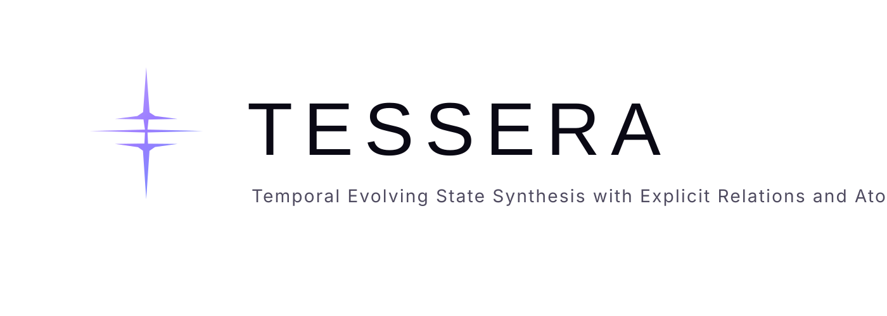
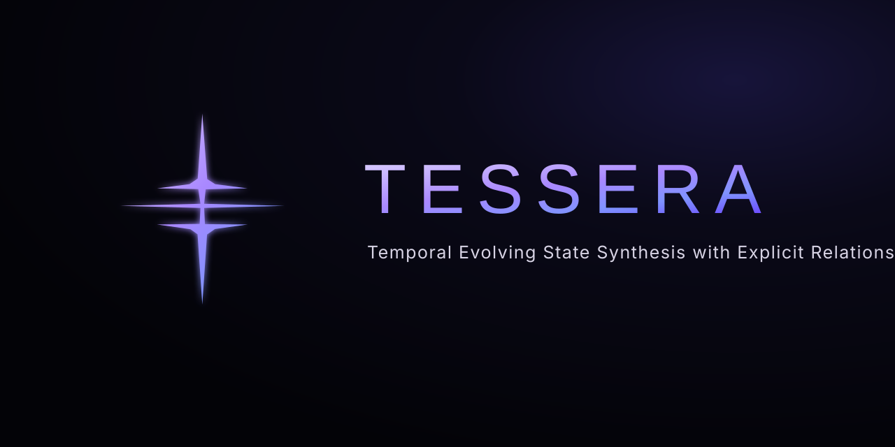

<p align="center">
  
</p>

<p align="center">
  <strong>Auditable memory infrastructure for agents.</strong><br/>
  Keep knowledge in text. Preserve where it came from. Retrieve evidence without forcing the agent to understand the memory system underneath.
</p>

---

# TESSERA

**Temporal Evolving State Synthesis with Explicit Relations and Atomic Memories.**

TESSERA is a **text-first, agent-agnostic memory and evidence layer** for long-running AI agents.

It sits between an agent and the project knowledge the agent needs to remember:

```text
Agent
  │
  │ natural-language memory need
  ▼
TESSERA
  │
  ├─ discovers textual knowledge
  ├─ normalizes metadata
  ├─ preserves memory + source identity
  ├─ indexes and ranks candidates
  ├─ extracts query-relevant evidence
  ├─ preserves relations and navigation
  └─ proves where evidence came from
  │
  ▼
Structured Evidence
  │
  ▼
Agent reasons and acts
```

> **TESSERA abstracts memory architecture away from the agent. It does not replace the cognition of the agent.**

## The problem in plain language

Saving notes is easy. Remembering the **right** thing later is not.

As an agent works for days, weeks or months, knowledge starts to spread across memory cards, research notes, project instructions, decisions and reference files. Then the hard questions appear:

- Is this still the same memory after the file moved?
- Which source version supports this evidence?
- Why did this result rank above another one?
- Which paragraph actually matched the query?
- Is a relationship explicit, inferred or derived?
- Which instruction applies to the current scope?
- Are two sources conflicting?
- Is there enough evidence to continue?

TESSERA exists to make those questions **explicit, inspectable and progressively testable** instead of hiding them inside a prompt or a black-box database.

## What TESSERA is — and is not

| TESSERA does | TESSERA does not |
| --- | --- |
| Organize and index textual knowledge | Replace the reasoning of the consuming agent |
| Preserve stable memory and source identity | Treat retrieval score as truth/confidence |
| Return query-aware evidence and provenance | Silently rewrite source files while indexing |
| Expose relations and navigation | Require a generative LLM for basic retrieval |
| Keep source text as the source of truth | Claim unfinished roadmap experiments already work |
| Make memory behavior measurable | Index source code as primary memory |

TESSERA is deliberately **evidence infrastructure**, not a final-answer chatbot.

---

## A 30-second example

Suppose a repository contains:

```text
memories/project-direction.md
memories/runtime-migration.md
AGENTS.md
research/architecture-notes.md
```

The agent asks:

```text
"what runtime strategy is currently documented for this project?"
```

TESSERA can return a structured result containing:

```yaml
id: project/runtime-strategy
type: factual
score: 0.81

relevant_evidence: >
  The project now uses a multi-runtime strategy for tool execution.

source:
  document_id: doc_...
  path: memories/runtime-migration.md

provenance:
  document_hash: ...
  content_hash: ...
  span:
    start_line: 18
    end_line: 21

related_ids:
  - project/runtime-history

body: |
  ...full original memory remains available...
```

The important boundary is simple:

```text
TESSERA finds, structures and proves the evidence.
The consuming agent decides what to do with it.
```

---

# Current Foundation

The current implementation already provides the substrate needed to build more advanced memory behavior without losing auditability.

## Canonical text understanding

Markdown may have complete, partial or no frontmatter. TESSERA normalizes it into one Canonical Metadata contract while preserving the original source metadata.

It distinguishes semantic memory from other useful textual artifacts:

```yaml
# semantic memory
classification:
  document_type: memory
  kind: factual
  drawer: facts
```

```yaml
# instruction document
classification:
  document_type: harness_instructions
  kind: instruction
  drawer: null
```

TESSERA intentionally keeps exactly **three semantic drawers**:

```text
facts
preferences
insights
```

Scope, relations, authority, confidence, temporal state and document type are **facets**, not additional drawers.

## Stable identity

TESSERA separates identity from location and version:

```text
identity.id
→ persistent knowledge identity

source.document_id
→ persistent source-document identity

source.path
→ current location

document_hash / content_hash
→ current version fingerprints
```

A rename or move can therefore preserve knowledge/source identity while changing only the path.

## Explainable retrieval

The current ranker uses inspectable local signals such as:

```text
TF-IDF lexical similarity
+ token overlap
+ title / ID relevance
+ metadata relevance
+ graph/PageRank contribution
+ deterministic type/intent boost
```

`score` means **retrieval relevance for this query**. It does not mean truth, confidence or authority.

Global recency is disabled by default because **newer is not the same as currently valid**.

## Query-aware evidence

TESSERA can foreground the paragraph most relevant to the query while preserving the complete memory:

```text
retrieval result
├─ relevant_evidence   ← query-specific
├─ evidence_info
└─ body                ← original full memory
```

If a useful paragraph cannot be supported, `relevant_evidence` remains `None` rather than fabricating a match.

## Evidence Ledger / provenance

Evidence is traceable to an exact source version:

```yaml
evidence_id: ev_...
memory_id: project/runtime-strategy
source:
  document_id: doc_...
  path: memories/runtime-migration.md
  document_hash: ...
  content_hash: ...
span:
  start_line: 18
  end_line: 21
```

If the exact occurrence cannot be proven — for example because identical text appears more than once — the span remains null instead of pretending to know more than the source supports.

## Basic write sanitization

The current write path includes a small deterministic sanitization gate for known hostile-instruction patterns and suspicious tags.

This is **not** the future memory-admission system. The broader admission experiment is still a Test Card and must prove whether novelty, duplication, evidence and state checks are worth the added complexity.

---

# How it works today

```text
TEXT SOURCES
   │
   ▼
DISCOVER
   │
   ▼
CANONICALIZE
   ├─ classification
   ├─ scope
   ├─ metadata
   └─ stable identity
   │
   ▼
TRACE
   ├─ source document
   ├─ hashes / source version
   └─ Evidence Ledger
   │
   ▼
INDEX + GRAPH
   │
   ▼
EXPLAINABLE RETRIEVAL
   │
   ▼
QUERY-AWARE EVIDENCE
   │
   ▼
STRUCTURED RESULT
   │
   ▼
CONSUMING AGENT
```

See [`docs/ARCHITECTURE.md`](docs/ARCHITECTURE.md) for the detailed current architecture and [`docs/ROADMAP.md`](docs/ROADMAP.md) for experiments that have **not** been promoted to product capabilities yet.

---

# Quickstart

TESSERA currently supports Python **3.9+**.

## Install for development

```bash
git clone https://github.com/LuigiFerronatto/TESSERA.git
cd TESSERA
pip install -e ".[dev]"
```

Or:

```bash
./install.sh --venv --dev
```

## Python API

```python
from tessera import TesseraEngine, Entity

engine = TesseraEngine(storage_dir="./memories")

engine.write_memory_note(
    mem_id="project/postgres-replication",
    mem_type="factual",
    episode_id="ep_001",
    content="The data team configured PostgreSQL read replication.",
    tags=["postgresql", "infra"],
    entities=[Entity("Data team", "Engineering")],
)

engine.build_index()

results = engine.retrieve_context(
    "who configured PostgreSQL read replication?",
    top_n=3,
)

for result in results:
    print(result["id"], result["score"])
    print(result["relevant_evidence"])
    print(result["provenance"])
```

## CLI

```bash
tessera init ./memories

tessera write ./memories \
  --id project/postgres-replication \
  --type factual \
  --episode ep_001 \
  --content "The data team configured PostgreSQL read replication." \
  --tags postgresql,infra

tessera index ./memories

tessera query ./memories "who configured PostgreSQL read replication?"

tessera query ./memories "how does this project work?" --debug
```

Source text remains authoritative. Derived index data lives under `.tessera_index/` and can be rebuilt.

---

# The retrieval contract

The Python engine currently exposes fields such as:

```text
id
type
score
score_explain
filepath / filename
relevant_evidence
evidence_info
body
frontmatter
related_ids
provenance
evidence
```

See [`docs/OUTPUT_CONTRACT.md`](docs/OUTPUT_CONTRACT.md) for field semantics and nullability.

One of the next Foundation experiments is transport parity so Python, CLI/JSON and MCP can expose the **same semantic result** rather than silently dropping evidence depending on the integration surface.

---

# Quality gate

TESSERA treats behavior as part of the product contract.

The repository already runs:

```text
CODE
 ↓
UNIT / CONTRACT TESTS
 ↓
CLI SMOKE
 ↓
SANITY RETRIEVAL EVAL
 ↓
OUTPUT ARTIFACTS
 ↓
CI GREEN
```

The sanity suite is intentionally small and synthetic. It is a **regression alarm**, not a competitive benchmark claim.

LongMemEval and competitive comparisons live in the benchmark roadmap, not in per-PR CI.

---

# Research-driven development

TESSERA does not turn papers directly into features.

```text
research signal
   ↓
hypothesis
   ↓
Test Card
   ↓
controlled experiment
   ↓
evidence
   ↓
KEEP | ITERATE | REVERT | DROP | DEFER
```

Examples currently informing experiments include:

| Research signal | TESSERA question |
| --- | --- |
| GraphMemix | Does query-aware, budgeted graph expansion beat indiscriminate expansion? |
| CaSKG | Does relation confidence reduce harmful graph traversal without killing recall? |
| MemToC | Does explicit evidence arbitration improve source selection and abstention? |
| RENDER | Does structured evidence presentation improve downstream use when retrieval is fixed? |
| LongMemEval | Which memory capabilities actually improve extraction, updates, temporal reasoning and abstention? |

See [`docs/research/`](docs/research/) for source notes, references, competitive landscape and decision trace.

---

# Experimental roadmap

TESSERA deliberately distinguishes **implemented** from **hypothesized**.

Near-term sequence:

```text
PUBLIC / GOVERNANCE HARDENING
  → project-agnostic public surface
  → README + visual assets
  → changelog + PR contract + CI v2

FOUNDATION
  → Engine / CLI / MCP contract parity
  → incremental + idempotent indexing
  → text ingestion coverage
  → structural segmentation
  → metadata/corpus diagnostics

MEASURE EARLY
  → LongMemEval baseline + renderer controls

THEN TEST
  → typed relations / query-aware graph expansion
  → temporal state / state keys
  → instruction applicability / authority
  → conflict + evidence arbitration
  → adaptive retrieval
  → evidence sufficiency / abstention
  → experiential learning
```

Nothing in that second half is considered solved until its Test Card earns a **KEEP** decision.

See [`docs/ROADMAP.md`](docs/ROADMAP.md).

---

# Development model

Every meaningful change follows:

```text
1 Issue
  ↓
1 Test Card
  ↓
linked PR
  ↓
Tests + Evaluation Card
  ↓
real CI / benchmark evidence
  ↓
Learnings
  ↓
KEEP | ITERATE | REVERT | DROP | DEFER
```

A feature can be technically correct and still end in **DROP** if the experiment shows no measurable value.

That is intentional.

---

# Documentation

Start with [`docs/README.md`](docs/README.md).

| Need | Document |
| --- | --- |
| Executive + product overview | [`docs/OVERVIEW.md`](docs/OVERVIEW.md) |
| Implemented capabilities | [`docs/FEATURES.md`](docs/FEATURES.md) |
| Vocabulary and semantic distinctions | [`docs/CONCEPTS.md`](docs/CONCEPTS.md) |
| Current architecture | [`docs/ARCHITECTURE.md`](docs/ARCHITECTURE.md) |
| Query examples | [`docs/QUERY_EXAMPLES.md`](docs/QUERY_EXAMPLES.md) |
| Retrieval output contract | [`docs/OUTPUT_CONTRACT.md`](docs/OUTPUT_CONTRACT.md) |
| Experimental roadmap | [`docs/ROADMAP.md`](docs/ROADMAP.md) |
| Papers / references / competitors | [`docs/research/`](docs/research/) |
| Brand assets | [`docs/assets/brand/`](docs/assets/brand/) |

---

# Project status

TESSERA is an evolving Foundation, not a finished long-term-memory product.

**Implemented today:**

```text
canonical metadata
stable memory/source identity
explainable local retrieval
query-aware evidence
Evidence Ledger / provenance
basic graph navigation
CLI + MCP surfaces
CI + sanity regression evaluation
```

**Still being tested:**

```text
incremental state correctness
transport contract parity
plain-text ingestion / segmentation
external benchmark quality
query-aware graph expansion
relation reliability
temporal state
source authority / instruction precedence
conflict / evidence arbitration
abstention semantics
adaptive retrieval
learning / utility feedback
```

That distinction — **what exists vs what we are trying to prove** — is part of TESSERA's engineering philosophy.

---

<p align="center">
  
</p>
