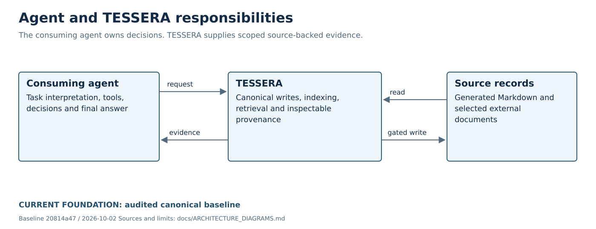

# Versioned architecture diagrams

Owners: [#80](https://github.com/LuigiFerronatto/TESSERA/issues/80) and public-history
cleanup [#78](https://github.com/LuigiFerronatto/TESSERA/issues/78).
Audited baseline: `20814a47ec0f72d7bea0639e0b057df1ecf5cded`, 2026-10-02.

The SVG files are editable evidence diagrams with accessible titles/descriptions,
plain system-font text and no external assets. Solid blue outlines mean current
Foundation behavior at the dated baseline. Dashed orange outlines and explicit
EXPERIMENTAL labels mean conditional target work. These styles never imply a
planned card has merged. Text labels carry the distinction independently of color.

| Diagram | Status | Current-reference / ownership source |
|---|---|---|
| [Agent boundary](assets/architecture/agent-boundary.svg) | Current | [ADR 0001](adr/0001-core-vs-optional-llm-boundary.md), [architecture](ARCHITECTURE.md) |
| [Memory lifecycle](assets/architecture/memory-lifecycle.svg) | Current | [Architecture](ARCHITECTURE.md), [output contract](OUTPUT_CONTRACT.md) |
| [Foundation architecture](assets/architecture/foundation-current.svg) | Current | [Architecture](ARCHITECTURE.md), [features](FEATURES.md), [MCP](MCP_RUNTIME.md) |
| [Cognitive-continuity target](assets/architecture/target-experimental.svg) | Experimental, conditional | [Roadmap](ROADMAP.md), owning #138/#136/#137/#73/#15/#16/#139/#140/#141/#20/#169/#167/#171/#196/#19 cards |
| [Experimental roadmap](assets/architecture/roadmap-experimental.svg) | Conceptual ordering, not a frozen schedule | [Roadmap](ROADMAP.md), #17/#19/#21/#157/#158 and temporal/state owners |
| [Structured evidence](assets/architecture/structured-evidence.svg) | Current field groups | [Output contract](OUTPUT_CONTRACT.md), [concepts](CONCEPTS.md) |

## Current responsibility boundary



The agent owns decisions and final answers. TESSERA returns scoped evidence and
handles explicit canonical writes. Indexing an external document does not grant
its instructions authority or change ownership of its bytes.

## Maintenance

Regenerate deterministically with:

```bash
python scripts/render_architecture_diagrams.py
```

Source diagrams and the generator are versioned together. Tests check exact
regeneration, all six mapped assets, labels and no remote image/script references.
Rendered SVGs were inspected individually. Change current labels only with
canonical merge/runtime evidence. Proposed component order is illustrative and
must not replace issue dependencies or select a product architecture.

Only the responsibility boundary is embedded in the main README; the guide
links the other five rather than turning onboarding into a wall of images.

## Historical cleanup and fidelity coordination

Legacy prose and the 22-slide HTML demo now use neutral examples and TESSERA
artwork. Private-project logos/mascot images were removed from the current tree;
they remain recoverable in pinned Git history. Audit/ADR histories explicitly
label normalized legacy identifiers and link their unchanged originals.
No production runtime identifier or behavior changed. Archived simulation
examples only changed local variable/example names and printed descriptions.

The QUMem map reuses the correction prepared in
[PR #284](https://github.com/LuigiFerronatto/TESSERA/pull/284), rather than inventing
a second research interpretation. That open PR is not counted as a second
runtime delivery or assumed merged by this cleanup.

The historical HTML demo keeps its 22-slide structure and a visible historical
notice. Static print rendering through WeasyPrint verifies content, local assets
and page fit. The cloud browser refused the localhost preview, so interactive
browser/navigation parity is not claimed. The existing navigation script is
unchanged and can receive a final browser check before publication outside the
repository.
