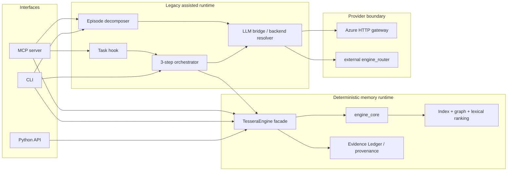
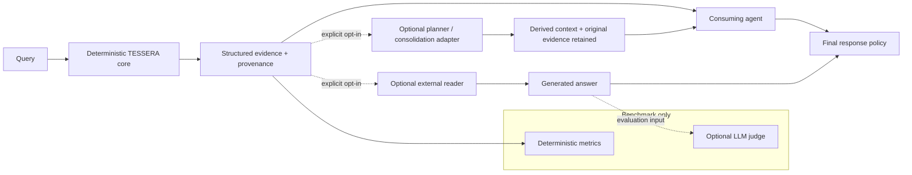

# ADR 0001: TESSERA Core vs Optional LLM Orchestrator Boundary

- **Status:** Accepted
- **Date:** 2026-08-30
- **Decision owner:** TESSERA architecture governance / issue #74
- **Benchmark applicability:** `NOT_APPLICABLE`

## Status vocabulary

Every architecture assertion in this record carries one of these labels:

- **CURRENT** — observed in the code at the accepting commit.
- **TARGET** — binding architecture for new work and migration.
- **DEPRECATED** — current behavior or documentation that must not be copied into new APIs.
- **PROPOSED FOLLOW-UP** — implementation or experiment deliberately left to a later Test Card.

## Context

**CURRENT** TESSERA has a deterministic retrieval stack and a legacy assisted
orchestrator in the same package. The deterministic stack returns evidence-rich
records; the orchestrator makes three LLM calls around that retrieval to infer
an information need, rewrite a query, and synthesize context.

**CURRENT** Some public documentation described the assisted path as an offline
simulation with optional flags. The actual CLI and MCP assisted entry points
require a resolvable real backend. Their bridge can then degrade a failed call
to a raw prompt echo. This made the product boundary, dependency expectations,
and failure semantics ambiguous.

**TARGET** TESSERA ends at deterministic memory infrastructure and structured
evidence. Optional adapters may plan, consolidate, or read that evidence. The
consuming agent owns cognition and the final response.

**TARGET** The primary flow is:

```text
Query
→ deterministic TESSERA retrieval
→ structured evidence with provenance
→ consuming agent or explicitly selected optional adapter
→ reasoning and final response
```

## Current implementation audit

### Observed current call graph

**CURRENT** The principal call paths observed in `engine.py`, `engine_core.py`,
`evidence.py`, `cli.py`, `mcp_server.py`, `orchestrator.py`, `hooks.py`,
`llm_bridge.py`, and `decomposer.py` are:



**CURRENT** Direct Python `retrieve_context()`, CLI `query`, and MCP
`query_memories()` all reach `TesseraEngine` and use the lossless retrieval
contract projection. CLI and MCP are transport/rendering layers around the
Engine contract.

**CURRENT** `TesseraEngine` subclasses the core engine, derives the Evidence
Ledger during indexing, and enriches core retrieval hits with document and
query-specific provenance.

**CURRENT** The core path parses canonical Markdown, creates deterministic
identities, builds TF-IDF and graph state, produces seed candidates, performs
bounded graph expansion and PageRank-based multi-signal ranking, applies the
current conflict resolver, and returns structured hits.

**CURRENT** `TesseraOrchestrator.run()` calls an LLM for information-need
analysis, calls it again for query planning, invokes deterministic retrieval,
and calls it a third time for context synthesis. Store selection is a
deterministic keyword rule over the generated information need. A no-result
retrieval retries the original task across stores.

**CURRENT** `TesseraTaskHook.on_task_start()` wraps that orchestrator and returns
both generated context and `raw_memories`. Explicit `on_task_end()` writes a
caller-provided memory. `on_task_end_auto()` delegates assisted episode
decomposition and writes its outputs through the normal write path.

**CURRENT** `resolve_llm_fn()` selects no backend by default and performs no
provider credential or project-file inspection. The deprecated project-specific
gateway and engine-router adapters require an explicit compatibility name plus
an endpoint or exact router path. Calls fail with typed errors and never echo
the raw prompt as output.

**CURRENT** Importing `tessera.mcp_server` eagerly constructs the deterministic
Engine and task-hook wrapper but does not resolve or probe a provider. Assisted
MCP tools still need the lifecycle/envelope refactor owned by #120; direct MCP
retrieval remains deterministic.

**CURRENT** `decompose_episode()` keeps assisted success distinct from assisted
failure. A valid JSON array is authoritative, including an intentional empty
`[]`. Expected provider failures, unparseable responses and invalid result
schemas reach the deterministic local heuristic. The diagnostic result API
labels that path `deterministic_fallback`; the compatibility API still returns
the same list shape. Fallback candidates are not durable until the ordinary
write gate accepts them.

### Public entry points and output contracts

| State | Entry point | Current behavior | Output |
|---|---|---|---|
| CURRENT | `TesseraEngine.retrieve_context()` | deterministic retrieval | evidence-rich hit dictionaries |
| CURRENT | CLI `query [--json]` | deterministic Engine query | human rendering or lossless JSON contract |
| CURRENT | MCP `query_memories()` | deterministic Engine query | lossless retrieval contract |
| CURRENT | MCP `query_store()` | deterministic typed-store query | reduced hand-projected hit fields |
| CURRENT | CLI `start` | real-LLM orchestration around retrieval | generated need/query/context plus raw hits in rendering |
| CURRENT | MCP `query_memories_pipeline()` | real-LLM hook orchestration | generated context plus `raw_memories` and backend name |
| CURRENT | `TesseraTaskHook` | assisted pre-task context; explicit or assisted post-task writes | interception result or persisted paths |
| CURRENT | CLI/MCP/Python episode decomposition | assisted extraction; deterministic heuristic on expected provider/parse/schema failure; gated writes | extracted/written memories plus truthful mode diagnostics where supported; valid `[]` remains empty |
| CURRENT | `tessera` package exports | exposes core and orchestrator/hook types together | flat import surface |

**CURRENT** A retrieval hit preserves stable memory ID, rank order, retrieval
score and explanation, full body/frontmatter, source path, related IDs,
query-relevant evidence, and Evidence Ledger provenance when available.

**CURRENT** `raw_memories` keeps those hits available beside assisted synthesis.
Generated `consolidated_context`, however, is prose and has no machine-checked
grounding or stable derived-output metadata. It can obscure, omit, or alter what
the evidence records say even though it does not replace `raw_memories` in the
current result object.

**CURRENT** LongMemEval V1 dev-50 is retrieval-only. It calls the Engine, keeps
ground truth evaluator-side, calculates deterministic retrieval metrics, and
does not run a reader, generation model, provider, or judge.

### Dependency and behavior findings

| State | Finding |
|---|---|
| CURRENT | Core retrieval imports no provider SDK and inspects no provider credential. |
| CURRENT | Base installation contains deterministic runtime dependencies only; the `llm` extra adds `requests`, and `mcp` adds MCP transport. |
| CURRENT | Optional adapters depend on the Engine; the Engine does not import them. |
| CURRENT | Benchmark reporting and evaluator code are not imported by runtime modules. |
| CURRENT | Missing backend selection fails construction of the orchestrator with a clear `ValueError`. |
| DEPRECATED | Backend auto-probing makes provider selection implicit. |
| DEPRECATED | After backend selection, bridge failures are printed and converted to raw prompt echoes, silently changing assisted semantics. |
| DEPRECATED | Documentation claims offline simulation, heuristic fallback, and assisted CLI/MCP flags that the current APIs do not provide. |
| DEPRECATED | Eager MCP hook construction couples deterministic MCP startup to optional LLM availability. |
| DEPRECATED | The flat package export and CLI module imports make the conceptual optional boundary less visible than the runtime dependency graph. |

## Decision

**TARGET** The accepted architecture is:



**TARGET** The deterministic core owns canonical ingestion, indexing,
retrieval, ranking, graph/metadata access, and source-grounded provenance. It is
independently installable and usable without a provider, key, network, reader,
planner, or judge.

**TARGET** Optional adapters consume core contracts and never become core
dependencies. The consuming agent owns reasoning, action policy, final answer,
and final abstention. Benchmark infrastructure measures components and never
becomes a runtime dependency.

## Responsibility matrix

**TARGET** Exactly one primary owner is assigned to every capability:

| Capability | Primary owner | Secondary consumers |
|---|---|---|
| canonical memory ingestion | Deterministic Core | Optional Adapter, Consuming Agent |
| indexing | Deterministic Core | Optional Adapter, Benchmark Infrastructure |
| deterministic retrieval | Deterministic Core | Optional Adapter, Consuming Agent, Benchmark Infrastructure |
| ranking | Deterministic Core | Optional Adapter, Consuming Agent, Benchmark Infrastructure |
| graph and metadata access | Deterministic Core | Optional Adapter, Consuming Agent |
| provenance | Deterministic Core | Optional Adapter, Consuming Agent, Benchmark Infrastructure |
| deterministic query compilation | Deterministic Core | Optional Adapter, Consuming Agent |
| LLM-assisted planning | Optional Adapter | Consuming Agent, Benchmark Infrastructure |
| context consolidation | Optional Adapter | Consuming Agent, Benchmark Infrastructure |
| answer synthesis | Optional Adapter | Consuming Agent, Benchmark Infrastructure |
| final answer policy | Consuming Agent | Optional Adapter |
| abstention decision | Consuming Agent | Optional Adapter, Benchmark Infrastructure |
| citations in a final answer | Consuming Agent | Optional Adapter |
| LLM-as-a-judge | Benchmark Infrastructure | none |
| benchmark scoring | Benchmark Infrastructure | Deterministic Core, Optional Adapter |

**TARGET** “Owner” means the layer that defines policy and correctness. A
secondary consumer may invoke or present the capability but may not silently
redefine it.

## Dependency rules

**TARGET** These rules are mandatory for new code and migration reviews:

1. Core modules must not import optional LLM providers or provider SDKs.
2. Optional adapters may depend on the core; the core must never depend on optional adapters.
3. Benchmark judge code must not be imported by runtime code.
4. Reader and synthesis adapters must consume the versioned structured-evidence contract.
5. Provider-specific code must remain behind an explicit adapter interface.
6. Base installation must not install an LLM provider SDK.
7. Deterministic retrieval must not inspect or require provider credentials.
8. Optional functionality must be explicitly selected.
9. An explicitly requested unavailable capability must fail with a clear, deterministic error.
10. Silent mode changes that alter retrieval or answer semantics are prohibited.
11. Optional-adapter failures must not fall through to a semantically different mode unless the caller explicitly configured and can observe that policy.
12. Runtime modules must not import benchmark datasets, labels, metrics, readers, or judges.

## Installation implications

| State | Installation surface | Contract |
|---|---|---|
| CURRENT | base package | deterministic Engine/CLI dependencies; no provider SDK |
| CURRENT | `mcp` extra | MCP transport dependency |
| CURRENT | `llm` extra | HTTP support through `requests`; it is not a complete provider-interface boundary |
| CURRENT | benchmark/dev tooling | test and benchmark code; deterministic LongMemEval runner has no judge |
| TARGET | base installation | deterministic core and direct transports that can start without provider credentials |
| TARGET | assisted extra | planner/provider adapters only, explicitly selected |
| TARGET | reader extra | generation/reader adapters only, explicitly selected |
| TARGET | benchmark extra | datasets, evaluators, and optional judge tooling; never runtime-required |

**PROPOSED FOLLOW-UP** Implement the conceptual extras and move legacy adapters
only under a dedicated packaging Test Card. This ADR does not change package
metadata or public imports.

## Execution modes

**TARGET** Modes are explicit architecture contracts, not automatic fallback
levels. Availability here does not imply current implementation.

| Mode | Owner | Required dependencies | Network | Determinism | Output contract | Provenance | Failure semantics | Benchmark applicability |
|---|---|---|---|---|---|---|---|---|
| O0 — Deterministic retrieval | Core | base | none | deterministic for fixed corpus/config/environment | structured evidence | original evidence IDs, rank, scores, source retained | deterministic retrieval error; no LLM fallback | retrieval metrics |
| O1 — Deterministic query compilation | Core | base plus future compiler | none | deterministic for fixed input/config | compiled query/route plus structured evidence | compiler trace and all retrieval provenance retained | explicit compile error or documented caller-selected direct-query policy | routing and retrieval ablations |
| O2 — Optional LLM-assisted planning | Optional Adapter | base plus explicit planner/provider | normally required by remote providers | model-dependent, not presumed deterministic | plan metadata plus structured evidence | original evidence untouched; model/adapter metadata recorded | clear unavailable/call/parse error; no silent planner substitution | planner vs O0/O1 ablation |
| O3 — Optional context consolidation | Optional Adapter | O0/O1/O2 plus explicit consolidator/provider | normally required by remote providers | model-dependent | labeled derived context plus original structured evidence | source evidence retained and synthesis never labeled as source | synthesis error returned separately; stored memory unchanged | renderer/consolidation evaluation with retrieval frozen |
| O4 — External reader | Consuming Agent (reader adapter is secondary) | structured evidence plus caller-selected reader | reader-dependent | reader-dependent | generated answer plus evidence references and reader metadata | input evidence remains inspectable; generated answer is not evidence | reader error leaves retrieval result usable; final policy stays with caller | answer-quality evaluation separated from retrieval |

**CURRENT** O0 exists through Python and CLI. The direct MCP query function
implements O0 semantics, but eager assisted-hook startup currently violates the
independence target. The legacy orchestrator approximates parts of O2 and O3
without the accepted explicit-selection, metadata, and failure contracts. O1
and a contract-compliant O4 are not implemented.

## Evidence and provenance invariants

**TARGET** Every optional layer must obey all of these invariants:

- Original retrieved evidence remains available.
- Stable evidence and memory IDs remain available.
- Rank, retrieval score, and score explanation remain available.
- Source provenance and source-version identity remain available.
- Derived context is labeled as derived and linked to its input evidence.
- Generated synthesis is never represented as source evidence.
- Adapter, provider, model, prompt/version, and relevant decoding metadata are recorded when an LLM is used.
- Optional planning or synthesis failure does not mutate stored memory or retrieval records.
- Reader output is not benchmark ground truth.
- LLM-judge output remains separate from retrieval metrics, reader outputs, and ground truth.

**TARGET** Optional layers may add annotations but may not destroy, overwrite,
or silently replace the structured retrieval contract.

## Failure and fallback semantics

**TARGET** O0 failure is local and deterministic. It must not trigger a provider
lookup. An optional mode is activated only by explicit caller choice.

**TARGET** Missing credentials, unavailable providers, timeouts, parse failures,
and policy rejections are typed/structured optional-capability failures. They
must identify the requested capability and leave core evidence usable where it
already exists.

**DEPRECATED** Prompt echo, undocumented backend failover, “simulated” output,
or heuristic output presented as assisted success are prohibited fallbacks
because they silently change semantics. The episode decomposer's documented
deterministic fallback is a separate, explicitly labelled result mode; it
neither invokes another provider nor persists around the ordinary write gate.

## Security implications

**TARGET** The core must not read provider credentials or transmit queries,
memories, provenance, or user content over the network. Provider adapters must
declare what is transmitted and apply caller-controlled redaction and retention
policy.

**TARGET** Generated plans, context, answers, and judge responses are untrusted
derived data. They cannot become durable source memory without the ordinary
explicit admission/write contract. Optional failures cannot mutate source
memory.

**TARGET** Benchmark labels and expected answers are evaluator-owned and must
never enter ingestion, retrieval queries, indexed metadata, reader context, or
provider prompts except where a versioned evaluator protocol explicitly needs
an answer for scoring after the system output has been frozen.

## LLM-as-a-judge boundary

**TARGET** LLM-as-a-judge is benchmark infrastructure, not a TESSERA core or
ordinary runtime capability. A future judge implementation requires:

- explicit opt-in;
- pinned judge model and provider;
- a versioned prompt;
- pinned temperature and decoding configuration;
- input and output hashes;
- an explicit retry policy;
- raw judge-response retention where licensing and privacy permit;
- token and monetary-cost reporting;
- parsing-failure reporting;
- deterministic non-LLM metrics preserved and reported separately;
- no mandatory judge execution in ordinary pull-request CI;
- no benchmark-label contamination of retrieval inputs; and
- no use of judge output as retrieval ground truth.

**CURRENT** No LLM judge is implemented. LongMemEval V1 dev-50 reports only
deterministic retrieval metrics.

## Abstention boundary

| State | Concern | Primary owner |
|---|---|---|
| CURRENT | retriever candidate emission, including an empty result | Deterministic Core |
| PROPOSED FOLLOW-UP | evidence-sufficiency estimation over retrieved evidence | explicitly evaluated adapter/core contract in #20 |
| TARGET | reader confidence about a generated answer | Optional reader adapter |
| TARGET | final answer/abstention policy | Consuming Agent |
| TARGET | abstention scoring and label interpretation | Benchmark Infrastructure |

**TARGET** A retriever returning candidates does not assert that evidence is
sufficient. A reader confidence score does not decide final policy. Benchmark
abstention labels do not become retrieval labels or thresholds.

**PROPOSED FOLLOW-UP** Thresholds and four-state evidence sufficiency require a
separate Test Card; this ADR defines ownership but implements no behavior.

## Benchmark implications

**CURRENT** This ADR changes documentation and contract tests only. It changes
no retrieval, ranking, indexing, evidence scoring, persistence, graph expansion,
temporal reasoning, conflict resolution, or benchmark runner behavior.

**TARGET** Retrieval metrics, rendering effects, reader answer quality,
abstention, and judge assessment are separate result families with explicit
inputs. A benchmark report must name which mode and component it measured.

**TARGET** The 50-question LongMemEval subset remains a development retrieval
profile, not an official full-dataset or answer-quality result.

## Rejected alternatives

**TARGET** We reject making an LLM mandatory for retrieval because it breaks
offline operation, auditability, reproducibility, and base-install isolation.

**TARGET** We reject hiding planning/synthesis inside `retrieve_context()`
because generated text and source evidence have different trust and provenance.

**TARGET** We reject making TESSERA's core the final reasoning agent because
action and answer policy belong to the consuming system.

**TARGET** We reject silent automatic backend/mode fallback because it prevents
callers and benchmarks from knowing what semantics ran.

**TARGET** We reject embedding an LLM judge in runtime or ordinary CI because a
judge is costly, nondeterministic evaluation infrastructure and not retrieval.

## Consequences

**TARGET** Direct retrieval remains small, local, inspectable, and independently
useful. Optional innovation can proceed without weakening the evidence contract.
Benchmarks can attribute changes to retrieval, rendering, reader, or judge.

**TARGET** Adapter authors must carry more explicit metadata and failure state.
Existing assisted APIs need migration instead of being treated as compliant by
name alone. Some legacy convenience imports and startup behavior will remain a
documented deviation until a scoped compatibility plan is accepted.

## Migration strategy and current deviations

| State | Deviation | Migration constraint |
|---|---|---|
| DEPRECATED | Orchestrator/backend auto-resolution and prompt-echo degradation | replace with explicit adapter selection and typed failure while preserving existing public API through a separately reviewed migration |
| DEPRECATED | MCP eagerly constructs the assisted hook | make deterministic MCP tools start without any provider; assisted tools initialize lazily and explicitly |
| DEPRECATED | CLI `start` and `decompose` always require a provider although old docs claimed offline defaults | define explicit assisted commands/modes and compatibility errors; do not invent simulated output |
| DEPRECATED | Generated context lacks stable model/adapter/prompt metadata and machine-checked evidence links | add a versioned derived-output envelope that embeds/references the untouched retrieval contract |
| DEPRECATED | `query_store()` uses a reduced projection while direct `query_memories()` has parity | decide whether typed-store transport adopts the same lossless contract in a dedicated contract change |
| DEPRECATED | Core and assisted types are flattened in package exports | introduce clear import/install namespaces only with compatibility and packaging tests |
| CURRENT | Episode-decomposition heuristic is the explicit deterministic fallback for expected provider, parse and schema failures | keep valid `[]` authoritative; keep fallback local/offline and label its diagnostics truthfully under Test Card #135 |

**PROPOSED FOLLOW-UP** Migration is incremental: preserve O0 first, isolate MCP
startup, define adapter interfaces and envelopes, then run controlled O1–O4
ablations. This ADR does not move/delete legacy code or redefine public APIs.

## Explicit non-goals

**TARGET** This decision does not implement O0–O4 changes, a compiler, planner,
reader, synthesis, judge, abstention threshold, LongMemEval V2, provider SDK,
ranking change, retrieval change, graph/temporal/conflict/persistence change, or
evidence-scoring change.

## Follow-up Test Cards

**PROPOSED FOLLOW-UP** The following order keeps variables separable. Existing
issue numbers are retained; proposed cards are descriptions, not newly created
issues.

| Order | Test Card | Objective | Dependencies | Acceptance criteria |
|---:|---|---|---|---|
| 1 | MCP deterministic-startup boundary | Remove eager optional-LLM initialization from direct MCP retrieval without changing retrieval output | ADR #74, contract #68 | MCP direct retrieval starts with no key/provider/network; assisted calls fail explicitly; parity tests remain green |
| 2 | Optional adapter interface and derived-output envelope | Define explicit planner/reader interfaces, metadata, typed errors, and evidence retention | ADR #74 | no core→adapter import; explicit selection; provenance invariants contract-tested |
| 3 | #17 deterministic compiler/adaptive retrieval | Evaluate O1 routing against O0 without mandatory generation | ADR #74, #20, #96 per issue routing | fixed corpus/reader; selected strategy observable; quality/cost gates met |
| 4 | #20 evidence sufficiency and abstention | Separate candidate emission, sufficiency estimate, reader confidence, final policy, and scoring | ADR #74, retrieval baseline | calibrated states tested without label leakage or hidden ranking tuning |
| 5 | #28 structured-evidence rendering ablation | Freeze retrieval and vary only O3/O4 rendering | #68, #96, adapter envelope | identical evidence set/reader/budget; retrieval and reader metrics separate |
| 6 | Reader and answer-quality evaluation | Evaluate O4 with frozen retrieval and versioned reader contract | adapter envelope, #28 | reader/model/prompt/cost recorded; citations checked; retrieval metrics preserved |
| 7 | LongMemEval V1 optional LLM judge | Add benchmark-only judge under the judge controls in this ADR | reader evaluation, #96 | explicit opt-in; pinned protocol; hashes/cost/failures retained; deterministic metrics separate |
| 8 | LongMemEval V1 full-500 evaluation | Run the frozen accepted pipeline over all 500 questions | dev-50 stability, reader/judge decision as applicable | full-dataset provenance, environment, costs, retrieval/reader/judge separation |
| 9 | LongMemEval V2 adapter | Evaluate V2 only after V1 ownership and controls are stable | full-500 decision and separate V2 Test Card | pinned dataset/schema, no V1 contract contamination, independently reproducible report |

**PROPOSED FOLLOW-UP** None of these cards is started by accepting this ADR.
